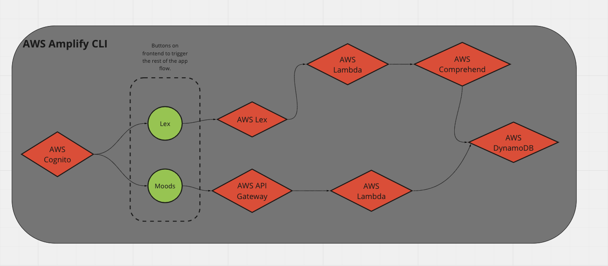
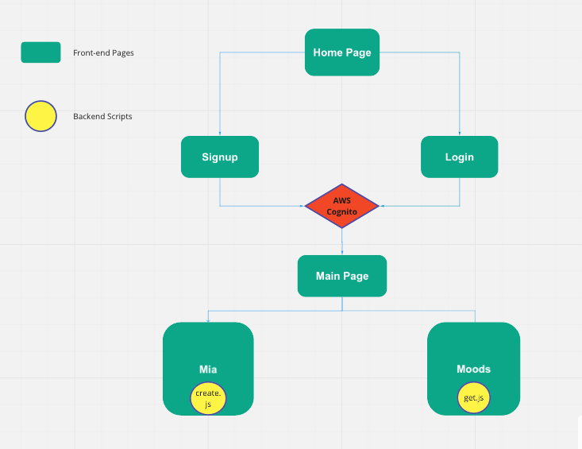
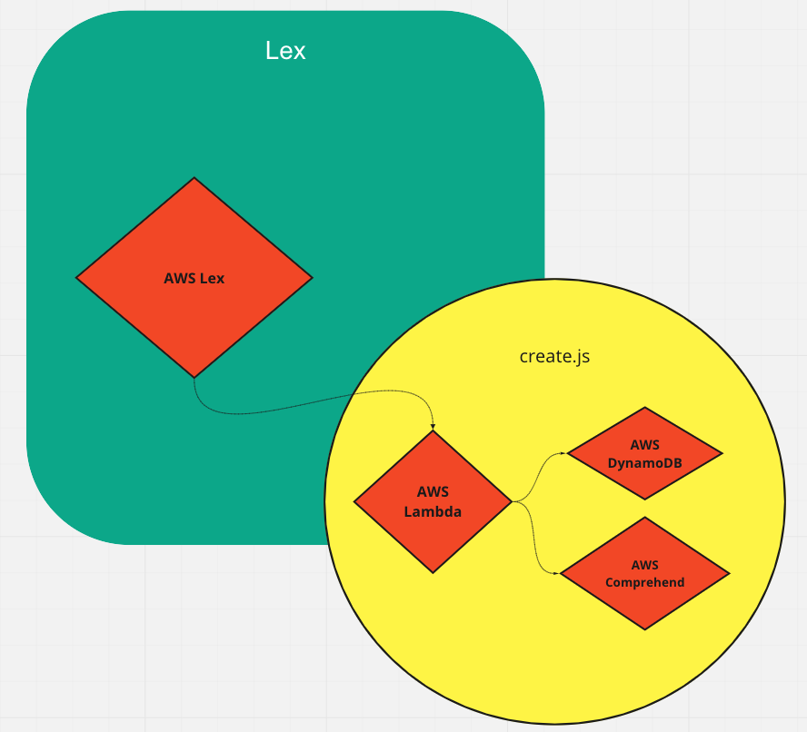
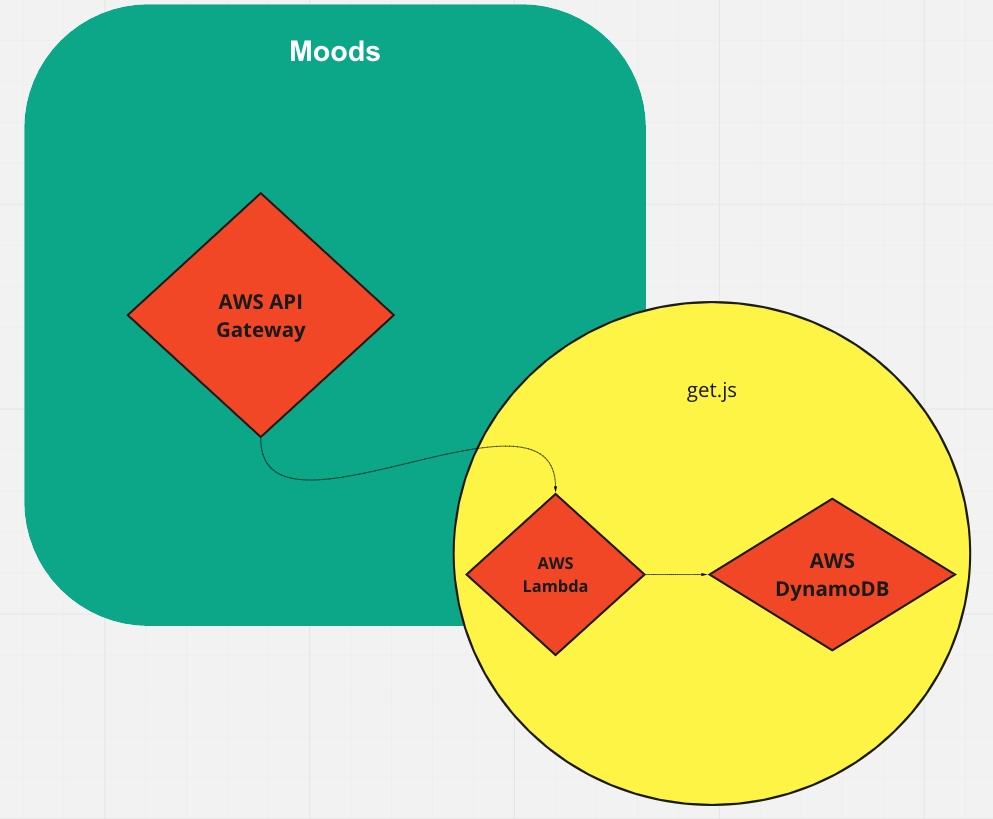

# I-AM

### **IMPORTANT:** 
For the sake of my own clarity and organization, this repo only contains the backend portion of the app. 

To view the front-end portion, please do the following:

1.) Click on this link to repo [i-am-client](https://github.com/AllergictoCrustaceans/i-am-client) 

**Further instructions on how to navigate the app will be explained on i-am-client**

## **What is I-AM?:**
I-AM is a serverless chatbot app that lets a user talk about any subject, then detects and tracks the user's emotions regarding that subject throughout time.

This app is intended to tackle the taboo of expressing vulnerability in society, and make user's more conscious of their emotions and reactions regarding any topics of their choice. 

## **Services used to build I-AM:**
The following APIs are integral to the app's functionality: 
- AWS Lex (to build the chatbot)
- AWS Comprehend (to do sentiment analysis)
- AWS Cognito (to authenticate/authorize user)

The following are used to contribute to the app flow:
- AWS API Gateway (to create /moods and /lex endpoints)
- AWS Amplify (Deployment)
- Lambda (to build backend scripts)
- Serverless (to make app serverless)
- React (to build front-end display of app)
- AWS DynamoDB (to persist data)

Services that were built into the app, but were ultimately not used:
- AWS S3

## **High-Level Overview of Services Connection/Usage**

In case the image is too small to view, here I go at describing its flow: 

The entire app is configured with AWS Amplify CLI (acts as the front-end umbrella of the app). The backend scripts (get.js, create.js) that correspond to the configured API endpoints are deployed as lambda functions via Serverless. After backend deployment, one of the lambda functions, create.js, is manually hooked onto the lex bot via AWS Lex console. 

Brief of create.js: It is designed to have the lex bot UI call the lex bot API, which invokes the lambda function create.js to call AWS Comprehend to do sentiment analysis, and call DynamoDB to save sentiment analysis data, user and bot input from lex data to persist data. 

Brief of get.js: It is invoked via AWS API Gateway endpoint /moods, and it is designed to get sentiment and topic values from dynamoDB to be displayed on the frontend. 

As for AWS Cognito, the security credentials are all created and configured on the AWS Management Console, and tested through AWS API Gateway Test CLI before building the frontend. 

## **High-Level Overview of App Flow (in association with Services)**

In case the image is too small to view, here I go at describing its flow:

1.) On Home page, there are two buttons on the top right of the nav bar. User has a choice to sign up, or login into the app. 

2.) Once logged in or registered, AWS Cognito authenticates and authorizes the user to head onto the next page, which is the main page. 

3.) The main page has two buttons. One button links to the lex bot under endpoint /mia. The other button links to a log of the user's topics and moods that has transpired between Mia and the user, and this is under endpoint /moods. 

4.) Under endpoint /mia, the user talks to lex chatbot, and the backend magic of create.js is invoked. Scroll down below to "What does create.js do?" for a brief description of this magic. 

5.) Under endpoint /moods, the user gets to see the log of their moods regarding all topics they've expressed opinions about, and the backend magic of get.js is invoked. Scroll down below to "What does get.js do?" for a brief description of this magic.

## **What does lambda function create.js do?**

create.js is a backend script that is hooked to the lex bot as a lambda function. Its job is to retrieve key-value pairs sent from the lexbot (from the front-end), use comprehend's detectSentiment method to deduce user's sentiment regarding a particular topic, and call dynamoDB to put lex bot's data, as well as the computed sentiment values to into a data table for safekeeping. 

## **What does lambda function get.js do?** 

get.js is a backend script that is NOT hooked to the lexbot, but is still created as a lambda function because of how the backend was deployed (via Serverless). Its job is to query back particular data columns (topic, sentiment values) of the authenticated user from dynamodb to be displayed in the frontend. In this case, get.js is connected to endpoint "/moods", so all results returned back from dynamodb query will display at that respective endpoint. 
