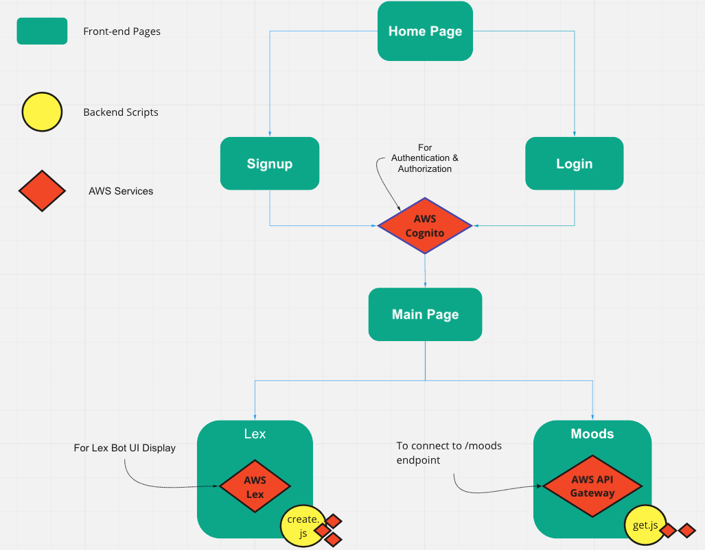

# I-AM

### **IMPORTANT:** 
For the sake of my own clarity and organization, this repo only contains the backend portion of the app. 
To view the front-end portion, please see the repo called [i-am-client](https://github.com/AllergictoCrustaceans/i-am-client), git clone the repo to a code editor of your choice, and "npm start". Or, click on link http://localhost:3000.

## **What is I-AM?:**
I-AM is a serverless chatbot app that lets a user talk about any subject, then detects and tracks the user's emotions regarding that subject throughout time. 

The following APIs are integral to the app's functionality: 
- AWS Lex (to build the chatbot)
- AWS Comprehend (to do sentiment analysis)
- AWS Cognito (using Oauth2 for user authentication/authorization)

The following are used to contribute to the app flow:
- AWS API Gateway (to create HTTP requests)
- AWS Amplify (Deployment)
- Lambda (to build backend scripts)
- Serverless (to make app serverless)
- React (to build front-end display of app)
- AWS DynamoDB (to hold data sent back from lambda)

Services that were built into the app, but were ultimately not used:
- AWS S3

## **High-Level Overview of Services Connection/Usage**

## **High-Level Overview of App Flow (in association with Services)**

## **What does create.js do?**

create.js is a backend script that is hooked to the lex bot as a lambda function. Its job is to retrieve key-value pairs sent from the lexbot (from the fron-end), use comprehend's detectSentiment method to deduce user's sentiment regarding a particular topic, then save lex bot's data, as well as the computed sentiment values to dynamoDB for safekeeping. 

## **What does get.js do?** 

get.js is a backend script that is NOT hooked to the lexbot, but it is still considered a lambda function because of how the backend was deployed (via serverless). Its job is to query back particular data columns (topic, sentiment values) of the authenticated user from dynamodb to be displayed in the frontend. In this case, get.js is connected to endpoint "/moods", so all results returned back from dynamodb query will display at that respective endpoint. 
